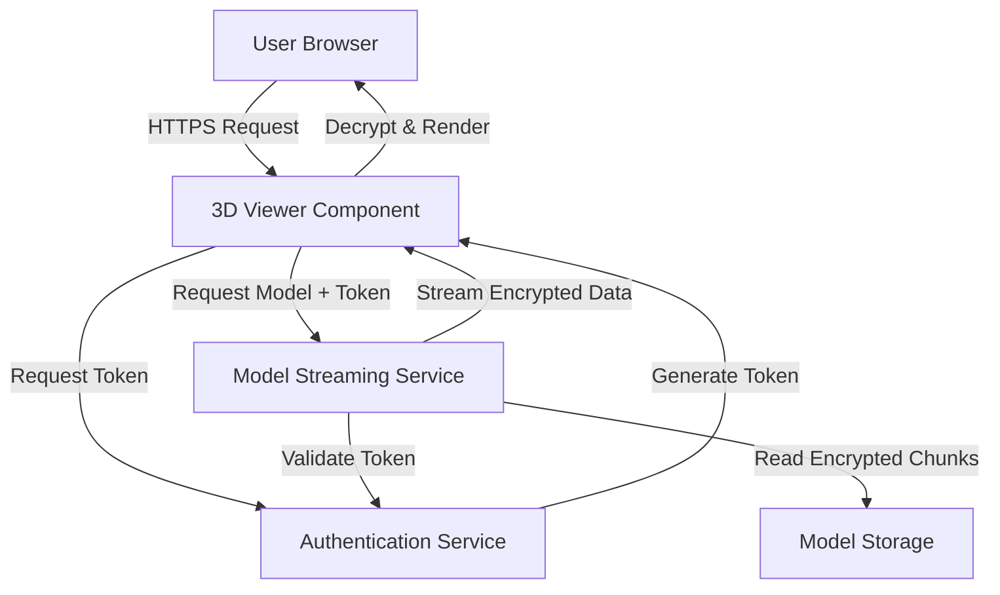

# Design Document: Secure 3D Model Deployment

## Overview

This design describes a secure web-based 3D model viewer that protects GLB model files from unauthorized download while providing an interactive viewing experience. The system uses a multi-layered security approach combining server-side streaming, token-based authentication, client-side encryption, and access controls.

The architecture separates concerns into three main layers:

1. **Client Layer**: Browser-based 3D viewer using Three.js for rendering
2. **Server Layer**: Node.js/Express backend for secure model streaming and access control
3. **Deployment Layer**: Static hosting with serverless functions for production deployment

Key security mechanisms:

- No direct file URLs exposed to clients
- Time-limited access tokens with signature validation
- XOR encryption of model data chunks during transmission
- In-memory decryption with no persistent storage
- HTTPS-only communication with security headers

## Architecture

### System Components



### Component Responsibilities

**3D Viewer Component (Client)**

- Initialize Three.js WebGL renderer
- Handle user interactions (rotate, zoom, pan)
- Request and validate access tokens
- Receive and decrypt model data chunks
- Render 3D model and animations
- Provide animation playback controls

**Authentication Service (Server)**

- Generate time-limited JWT access tokens
- Validate token signatures and expiration
- Manage session-specific encryption keys
- Enforce access control policies

**Model Streaming Service (Server)**

- Validate incoming requests with tokens
- Read model files from secure storage
- Apply XOR encryption to data chunks
- Stream encrypted chunks to client
- Implement rate limiting and abuse prevention

**Model Storage**

- Store GLB files in non-public directory
- Serve files only through streaming service
- Maintain compressed and original versions

## Components and Interfaces

### Client-Side Components

#### ModelViewer Class

```typescript
class ModelViewer {
  scene: THREE.Scene
  camera: THREE.PerspectiveCamera
  renderer: THREE.WebGLRenderer
  controls: OrbitControls
  mixer: THREE.AnimationMixer | null
  animations: THREE.AnimationClip[]
  currentAnimation: THREE.AnimationAction | null

  constructor(container: HTMLElement)
  async initialize(): Promise<void>
  async loadModel(modelUrl: string, token: string): Promise<void>
  playAnimation(index: number): void
  pauseAnimation(): void
  restartAnimation(): void
  dispose(): void
}
```

**Methods:**

- `initialize()`: Set up Three.js scene, camera, renderer, and controls
- `loadModel(modelUrl, token)`: Fetch encrypted model chunks, decrypt, and load into scene
- `playAnimation(index)`: Start playing animation at specified index
- `pauseAnimation()`: Pause current animation playback
- `restartAnimation()`: Reset animation to start and play
- `dispose()`: Clean up resources and clear memory

#### SecureModelLoader Class

```typescript
class SecureModelLoader {
  private encryptionKey: Uint8Array

  constructor(encryptionKey: Uint8Array)
  async fetchEncryptedModel(url: string, token: string): Promise<ArrayBuffer>
  private decryptChunk(chunk: Uint8Array): Uint8Array
  private xorDecrypt(data: Uint8Array, key: Uint8Array): Uint8Array
}
```

**Methods:**

- `fetchEncryptedModel(url, token)`: Stream encrypted chunks from server and decrypt
- `decryptChunk(chunk)`: Apply XOR decryption to a single chunk
- `xorDecrypt(data, key)`: Perform XOR operation between data and key

#### AuthenticationClient Class

```typescript
class AuthenticationClient {
  private apiBaseUrl: string

  constructor(apiBaseUrl: string)
  async requestAccessToken(): Promise<TokenResponse>
  async refreshToken(currentToken: string): Promise<TokenResponse>
  isTokenExpired(token: string): boolean
}
```

**Methods:**

- `requestAccessToken()`: Request new access token from server
- `refreshToken(currentToken)`: Refresh an existing token before expiration
- `isTokenExpired(token)`: Check if token has expired

### Server-Side Components

#### AuthenticationService Class

```javascript
class AuthenticationService {
  constructor(secretKey, tokenExpiration)
  generateToken(sessionId)
  validateToken(token)
  generateEncryptionKey(sessionId)
  revokeToken(token)
}
```

**Methods:**

- `generateToken(sessionId)`: Create JWT with session ID and expiration
- `validateToken(token)`: Verify signature and check expiration
- `generateEncryptionKey(sessionId)`: Create session-specific XOR key
- `revokeToken(token)`: Invalidate a token before expiration

#### ModelStreamingService Class

```javascript
class ModelStreamingService {
  constructor(modelDirectory, chunkSize)
  async streamModel(modelName, token, encryptionKey, response)
  private encryptChunk(chunk, key)
  private validateModelAccess(modelName, token)
}
```

**Methods:**

- `streamModel(modelName, token, encryptionKey, response)`: Stream encrypted model chunks
- `encryptChunk(chunk, key)`: Apply XOR encryption to chunk
- `validateModelAccess(modelName, token)`: Verify token and model permissions

### API Endpoints

**POST /api/auth/token**

- Request: `{ sessionId?: string }`
- Response: `{ token: string, encryptionKey: string, expiresIn: number }`
- Description: Generate new access token and encryption key

**GET /api/models/:modelName/stream**

- Headers: `Authorization: Bearer <token>`
- Response: Encrypted binary stream (application/octet-stream)
- Description: Stream encrypted model data chunks

**POST /api/auth/refresh**

- Request: `{ token: string }`
- Response: `{ token: string, expiresIn: number }`
- Description: Refresh existing token before expiration

## Data Models

### TokenPayload

```typescript
interface TokenPayload {
  sessionId: string
  issuedAt: number
  expiresAt: number
  modelAccess: string[]
}
```

### TokenResponse

```typescript
interface TokenResponse {
  token: string
  encryptionKey: string
  expiresIn: number
}
```

### ModelMetadata

```typescript
interface ModelMetadata {
  name: string
  size: number
  compressed: boolean
  animations: AnimationInfo[]
}

interface AnimationInfo {
  name: string
  duration: number
  index: number
}
```

### ViewerConfig

```typescript
interface ViewerConfig {
  apiBaseUrl: string
  modelName: string
  enableAnimations: boolean
  autoPlay: boolean
  backgroundColor: number
  cameraPosition: { x: number; y: number; z: number }
}
```

## Correctness Properties

_A property is a characteristic or behavior that should hold true across all valid executions of a system—essentially, a formal statement about what the system should do. Properties serve as the bridge between human-readable specifications and machine-verifiable correctness guarantees._

### Property 1: WebGL Initialization and Rendering

_For any_ valid viewer configuration, initializing the viewer should successfully create a WebGL rendering context and render the 3D model without errors.

**Validates: Requirements 1.1**

### Property 2: Camera Controls Responsiveness

_For any_ user interaction (rotation, zoom, pan), the camera position and orientation should update accordingly and remain within valid bounds.

**Validates: Requirements 1.2**

### Property 3: Animation Detection Completeness

_For any_ GLB model file with N embedded animations, the viewer should detect and load exactly N animations with correct metadata.

**Validates: Requirements 2.1**

### Property 4: Animation Playback State Consistency

_For any_ animation in the model, calling play should transition the animation to playing state, calling pause should transition to paused state, and calling restart should reset to the beginning.

**Validates: Requirements 2.2, 2.3, 2.4**

### Property 5: Animation Selection Independence

_For any_ model with multiple animations, selecting and playing animation at index i should not affect the state of animations at other indices.

**Validates: Requirements 2.5**

### Property 6: Animation Loop Configuration

_For any_ animation and loop configuration setting, when the animation completes, it should either restart from the beginning (if loop=true) or stop at the final frame (if loop=false).

**Validates: Requirements 2.6**

### Property 7: URL Security - No Direct File Paths

_For any_ page in the application, the HTML source and network requests should not contain direct file system paths to GLB model files.

**Validates: Requirements 3.1**

### Property 8: Streaming Endpoint Exclusivity

_For any_ model data received by the client, it should originate from the streaming API endpoint and not from direct file URLs.

**Validates: Requirements 3.3**

### Property 9: Token Validation Enforcement

_For any_ request to the model streaming endpoint without a valid token, the server should reject the request and not serve model data.

**Validates: Requirements 3.4, 4.4**

### Property 10: Chunked Delivery

_For any_ model streaming response, the data should be delivered in multiple chunks rather than as a single complete file.

**Validates: Requirements 3.5**

### Property 11: Token Generation and Expiration

_For any_ token generation request, the system should produce a token with an expiration time set to 1 hour from issuance.

**Validates: Requirements 4.1, 4.2**

### Property 12: Expired Token Rejection

_For any_ token that has passed its expiration time, requests using that token should be rejected with authentication failure.

**Validates: Requirements 4.3**

### Property 13: Encryption Round-trip Consistency

_For any_ model data chunk and encryption key, encrypting then decrypting the chunk should produce data identical to the original.

**Validates: Requirements 5.1, 5.3**

### Property 14: Session Key Uniqueness

_For any_ two different user sessions, the encryption keys generated should be different from each other.

**Validates: Requirements 5.2**

### Property 15: No Persistent Storage of Decrypted Data

_For any_ model loading operation, after completion, no decrypted model data should be present in browser localStorage, sessionStorage, or cache storage.

**Validates: Requirements 5.4**

### Property 16: CORS Header Configuration

_For any_ API response from the server, the response should include appropriate CORS headers that restrict cross-origin access.

**Validates: Requirements 6.4**

### Property 17: Network Error Retry Logic

_For any_ network error during model loading, the system should retry the request up to 3 times before failing permanently.

**Validates: Requirements 8.1**

### Property 18: Error Logging Consistency

_For any_ error that occurs in the system, an error message should be logged to the console with relevant context information.

**Validates: Requirements 8.4**

### Property 19: Error Resilience

_For any_ unexpected error during rendering or model loading, the application should catch the error and maintain UI responsiveness without crashing.

**Validates: Requirements 8.5**

### Property 20: Progressive Loading Feedback

_For any_ model loading operation, progress events should be emitted at regular intervals indicating the percentage of data loaded.

**Validates: Requirements 9.2**

### Property 21: Lazy Texture Loading

_For any_ model with multiple textures, textures should only be loaded into GPU memory when they are needed for rendering, not all at once.

**Validates: Requirements 9.4**

### Property 22: Shader Program Caching

_For any_ shader program used in rendering, after the first compilation, subsequent uses should retrieve the cached program rather than recompiling.

**Validates: Requirements 9.5**

### Property 23: WebGL Capability Detection

_For any_ browser environment, the system should correctly detect whether WebGL 2.0 is available and fall back to WebGL 1.0 if not.

**Validates: Requirements 10.2, 10.3**

### Property 24: Security Headers Completeness

_For any_ HTTP response from the server, all required security headers (Content-Security-Policy, X-Frame-Options, X-Content-Type-Options, Referrer-Policy, Strict-Transport-Security) should be present with appropriate values.

**Validates: Requirements 11.1, 11.2, 11.3, 11.4, 11.5**

## Error Handling

### Client-Side Error Handling

**Network Errors**

- Implement exponential backoff for retry attempts (1s, 2s, 4s)
- Display user-friendly error messages with retry options
- Log detailed error information to console for debugging

**WebGL Errors**

- Detect WebGL context loss and attempt recovery
- Display compatibility warnings for unsupported browsers
- Gracefully degrade to error state if WebGL unavailable

**Model Loading Errors**

- Validate model file format before parsing
- Handle corrupted or incomplete model data
- Display specific error messages for different failure types

**Animation Errors**

- Handle missing or invalid animation data
- Prevent playback of corrupted animations
- Fall back to static model display if animations fail

### Server-Side Error Handling

**Authentication Errors**

- Return 401 for invalid or expired tokens
- Return 403 for valid tokens with insufficient permissions
- Log authentication failures for security monitoring

**Streaming Errors**

- Handle file not found errors (404)
- Manage file read errors gracefully
- Implement timeout for long-running streams

**Rate Limiting**

- Implement token bucket algorithm for request throttling
- Return 429 Too Many Requests when limits exceeded
- Include Retry-After header in rate limit responses

### Error Response Format

```typescript
interface ErrorResponse {
  error: {
    code: string
    message: string
    details?: any
    timestamp: number
  }
}
```

## Testing Strategy

### Dual Testing Approach

This system requires both unit tests and property-based tests for comprehensive coverage:

**Unit Tests** focus on:

- Specific examples of correct behavior
- Edge cases (empty models, single animation, no animations)
- Error conditions (network failures, invalid tokens, corrupted data)
- Integration points between components

**Property-Based Tests** focus on:

- Universal properties that hold for all inputs
- Comprehensive input coverage through randomization
- Invariants that must be maintained
- Round-trip properties (encryption/decryption, serialization)

### Property-Based Testing Configuration

**Testing Library**: Use `fast-check` for JavaScript/TypeScript property-based testing

**Test Configuration**:

- Minimum 100 iterations per property test
- Each test must reference its design document property
- Tag format: `// Feature: secure-3d-model-deployment, Property N: [property text]`

**Example Property Test Structure**:

```typescript
import fc from 'fast-check'

describe('Encryption Round-trip', () => {
  it('should preserve data after encrypt-decrypt cycle', () => {
    // Feature: secure-3d-model-deployment, Property 13: Encryption Round-trip Consistency
    fc.assert(
      fc.property(
        fc.uint8Array({ minLength: 1, maxLength: 1024 }),
        fc.uint8Array({ minLength: 32, maxLength: 32 }),
        (data, key) => {
          const encrypted = xorEncrypt(data, key)
          const decrypted = xorDecrypt(encrypted, key)
          return arraysEqual(data, decrypted)
        }
      ),
      { numRuns: 100 }
    )
  })
})
```

### Unit Test Coverage

**Client-Side Unit Tests**:

- ModelViewer initialization and disposal
- Animation control functions (play, pause, restart)
- Token request and refresh flows
- Error message display for specific scenarios
- WebGL capability detection

**Server-Side Unit Tests**:

- Token generation with correct expiration
- Token validation with various invalid inputs
- Model streaming with valid and invalid tokens
- CORS header configuration
- Security header presence and values
- Rate limiting behavior

### Integration Tests

- End-to-end model loading flow
- Token expiration and refresh cycle
- Error recovery and retry mechanisms
- Animation playback across different model types
- Security header validation in deployed environment

### Test Data

**Model Test Files**:

- Small model (< 1MB) for fast tests
- Model with single animation
- Model with multiple animations
- Model with no animations
- Corrupted model file for error testing

**Token Test Cases**:

- Valid unexpired token
- Expired token
- Token with invalid signature
- Malformed token string
- Missing token

### Deployment Testing

**Pre-Deployment Checklist**:

- All unit tests pass
- All property tests pass (100+ iterations each)
- Build process completes without errors
- Assets are minified and compressed
- Source maps are generated
- Security headers are configured
- HTTPS redirect is enabled
- CORS policy is correctly set

**Post-Deployment Verification**:

- Model loads successfully in production
- Animations play correctly
- Direct file access returns 403
- Security headers are present in responses
- Token authentication works end-to-end
- Error handling displays appropriate messages
